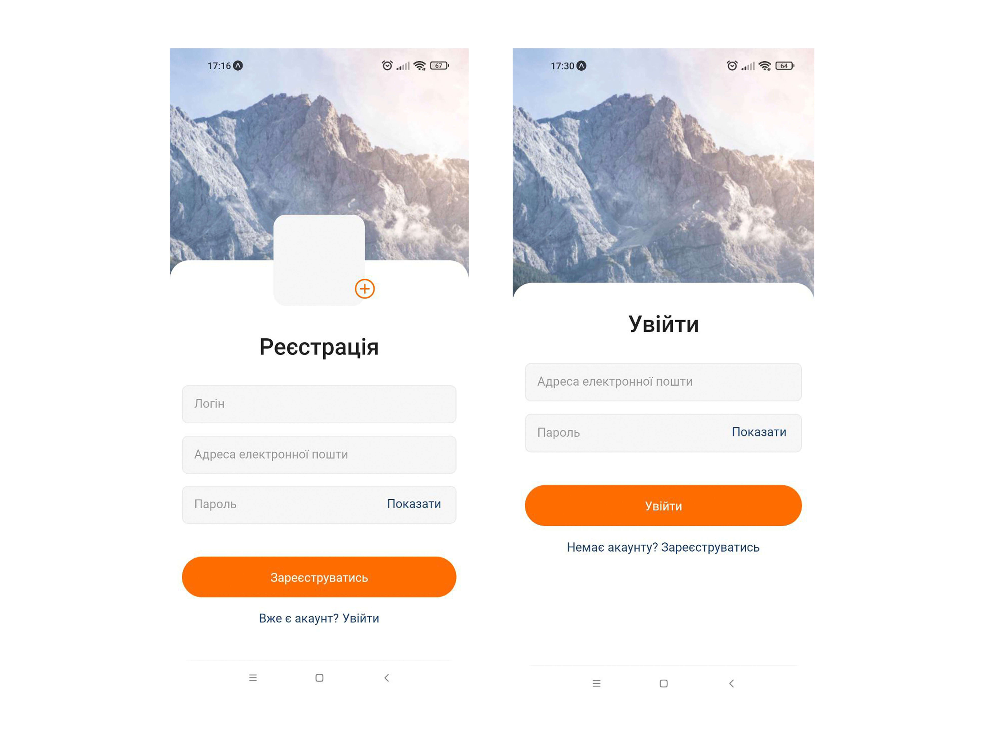
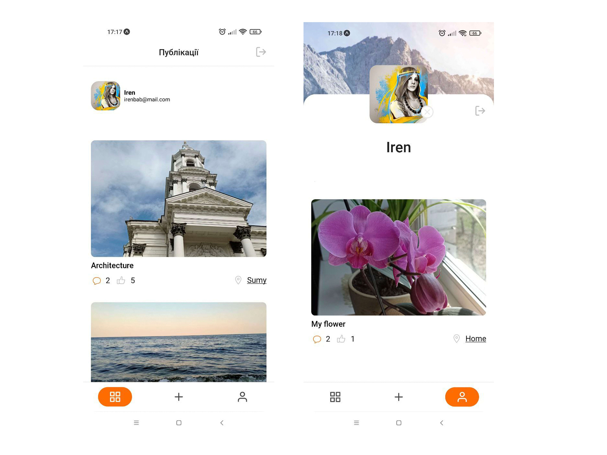
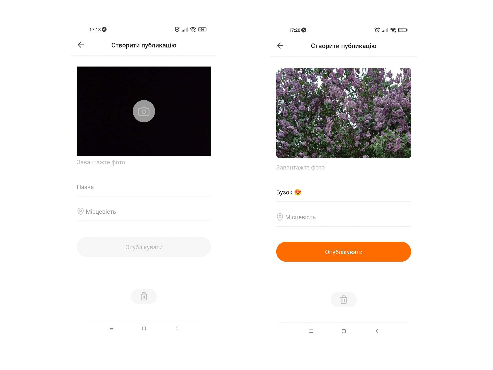
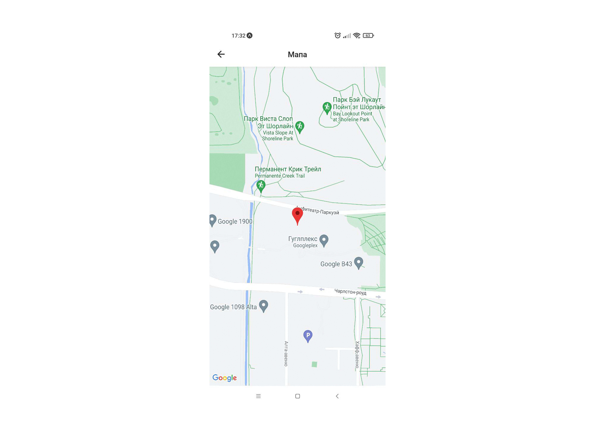

# PicShare - додаток щоб ділитися фото, враженнями та спогадами з іншими.

Реалізована регістрація та вхід:

Екрани Публікації та Профіль користувача:

Екран створення нової публікації:

Підключені геолокація та мапа:

<ul>Основний функціонал:</ul>
<li>Реалізована регістрація, вхід та вихід з профілю користувача</li>
<li>Створення нового посту: можливість завантажити фотографію, чи зробити камерою нову; додати опис фото та локацію</li>
<li>Є можливість додавати коментарі та вподобайки</li>
<li>Реалізована прив'язка геолокації до посту та відтворення на карті по кліку на локацію</li>

Додаток створений за допомогою Expo Go. 
Використані наступні технології і бібліотеки: 
React Native, react-navigation, redux, firebase, expo-camera , expo-image-picker, react-native-maps та ін.
